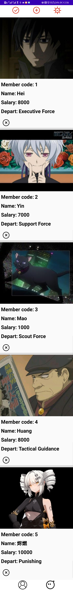
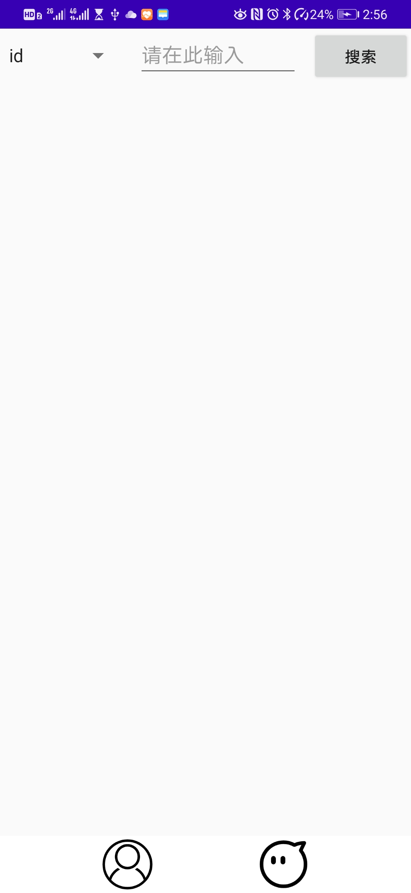
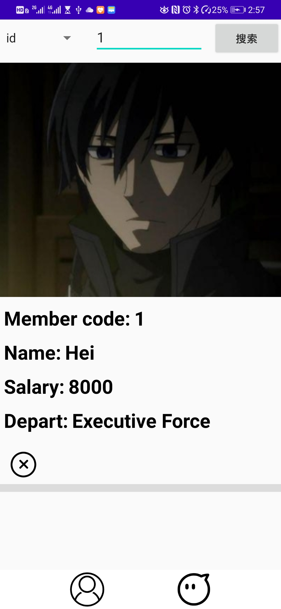
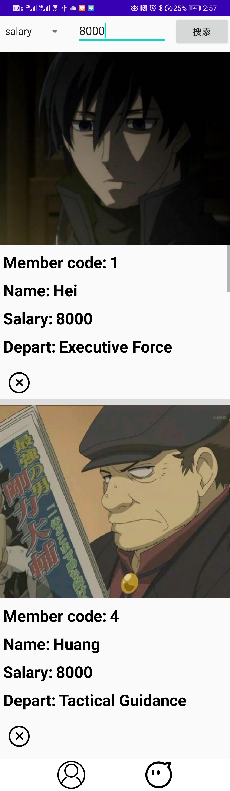
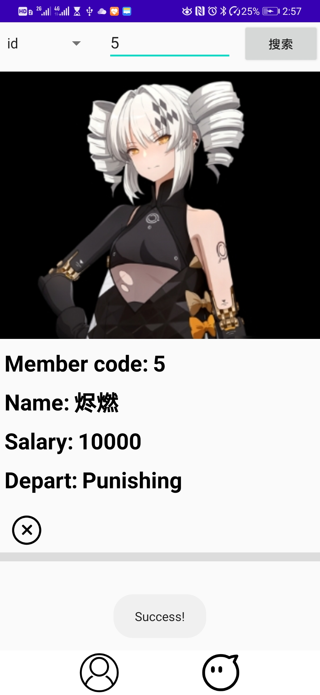
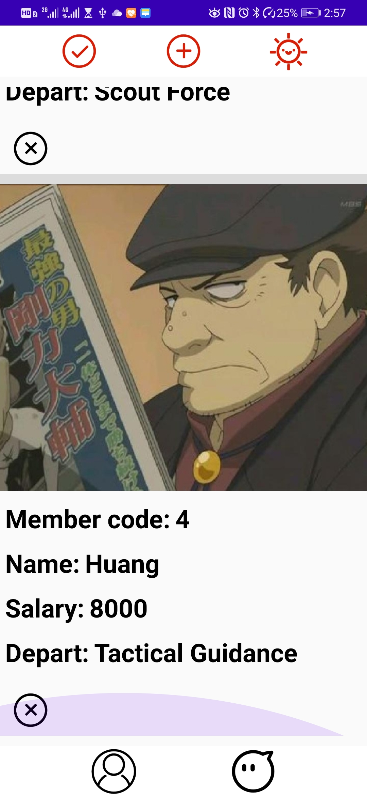

# android-sql-exercise
---
title: Android-SQLite
date: 2020-04-08 19:35:00
tags: 
	- Android
---


## 成果演示

### 加载数据后




### 搜索界面




### 搜索







## 删除







可发现原本的烬燃被删除掉了


## 问题

### ROOT

手机无法获取`ROOT`权限，所以无法查看数据库文件。

虚拟机太卡，没有使用


### 数据库存取图片

[参考：小小鸟儿](https://www.cnblogs.com/wxmdevelop/p/6180424.html)


#### 读取图片文件

```java
values.put("image",convertToByte(R.drawable.dtb_4));
values.put("name", "Huang");
values.put("salary", 8000);
values.put("depart", "Tactical Guidance");
//自己封装的函数，作用是将value存入数据库
insertRow(MainActivity.this,dbHelper,values);
```

#### 图片转换为二进制流存入数据库

```java
//图片格式转换
    protected byte[] convertToByte(int id){
        ByteArrayOutputStream baos = new ByteArrayOutputStream();
        Bitmap bitmap = ((BitmapDrawable) getResources().getDrawable(id)).getBitmap();
        bitmap.compress(Bitmap.CompressFormat.JPEG, 100, baos);
        return baos.toByteArray();
    }
```


#### 数据库读取二进制数据

```java
byte[] staffImage = cursor.getBlob(cursor.getColumnIndex("image"));
```

> 从数据库中读取存储的二进制


#### Adapter 中绑定

```java
Bitmap bitmap = BitmapFactory.decodeByteArray(staffListCard.getImageBody(),
                0, staffListCard.getImageBody().length);
viewHolder.imageBody.setImageBitmap(bitmap);
```

> 将二进制数据转换为BitMap，再把BitMap设置为ImageView的内容


#### `constraintlayout`下`ListView`遮盖其他组件问题

```xml
<ListView
	android:layout_height="0dp"/>
```

> 设置上下约束后，再将高度为0dp可解决


#### ListView中Item内组件的单击触发

> 实现OnClickListener接口，重写了构造方法，能够获取List中Item的position ，从而对特定item进行操作

```java
public class ListItemClick implements View.OnClickListener {
    private int position;

    public ListItemClick(int position) {
        this.position = position;
    }

    @Override
    public void onClick(View v) {

    }
}
```

> adapter 中绑定单击事件

```java
 viewHolder.staffDeleteBtn.setOnClickListener(new ListItemClick(position){
     // 使用的自己实现的ListItemClick，类，重写
            @Override
            public void onClick(View v) {
                //根据Position获取对应的Item对象
                ComponentStaffList staffListCard =getItem(position) ;
                //获取该Item中所需要的信息
                String deletedId = staffListCard.getStaffId();
                //创建数据库对象
                dbHelper = new MyDatabaseHelper(mcontext ,"StaffTable.db", null, DB_VERSION);
                //自己封装的方法，通过列“id”来删除特定行
                deleteSpecificRow(mcontext,dbHelper,"id", deletedId);
                //LogCat用于调试
                Log.d("SQL",deletedId);
            }
        });
```


### Constant  常量类

```java
public class Constant {
    public static int DB_VERSION = 11;
}

```

> 只有一个变量，用于控制数据库版本。

### 代码

> 类文件过多，详情请见github
